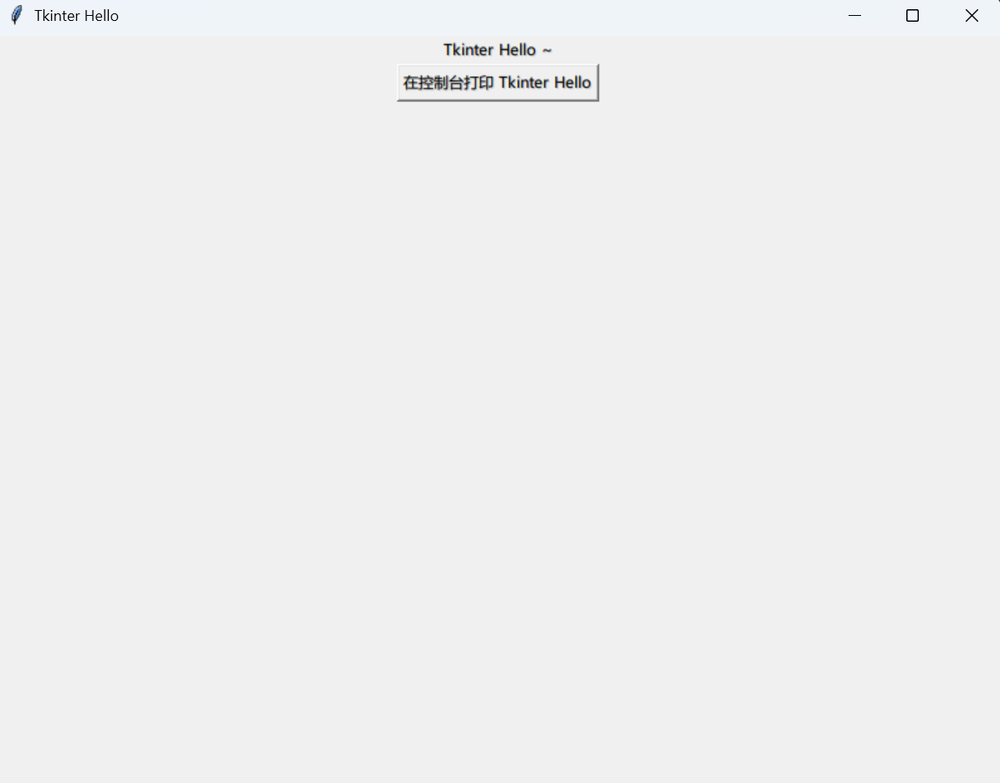

# 添加控件

<Constructing></Constructing>

:::info 如果你期待用更有挑战性的项目练手的话……
这里有一份来自 TkDocs 的教程，关于如何制作一个简单且完整的英尺-米换算器，同样供你参考：

<https://tkdocs.com/tutorial/firstexample.html>
:::

## 定义布局、添加控件
```python [main.py] {5,7,8,10,11}
from tkinter import *

def main():
    root = Tk()
    root.title("Tkinter Hello")

    frame = Frame(root)
    frame.pack()

    Label(frame, text="Tkinter Hello ~").pack()
    Button(frame, text="在控制台打印 Tkinter Hello").pack()

    root.mainloop()

if __name__ == '__main__':
    main()
```

以上代码添加的功能：
* 将窗口标题设置为 `Tkinter Hello`
* 定义 `frame` 为 `root` 上的一个 [pack 布局](./layout.md)。
* 向 `frame` 中添加一个 Label 和一个 Button。

其中，`root` 是我们的程序窗口。

运行此文件，得到了一个新的窗口：


现在我们遇到了问题：**窗口太小了！** 再添加布局和组件之后，Tkinter 自动将窗口调整到了最小，正好容纳所有组件，但是这么小的窗口真的能用吗？~~连我的标题都显示不全了说~~

## 调整窗口大小
调节窗口大小需要使用 `root` 的方法。

```python [main.py] {6}
from tkinter import *

def main():
    root = Tk()
    root.title("Tkinter Hello")
    root.geometry("800x600")

    frame = Frame(root)
    frame.pack()

    Label(frame, text="Tkinter Hello ~").pack()
    Button(frame, text="在控制台打印 Tkinter Hello").pack()

    root.mainloop()

if __name__ == '__main__':
    main()
```

有些反直觉的是，窗口的**长**和**宽**这两种显然应该是数字的东西，被合并在一起以字符串的方式传入。Tkinter 特色嘛。总之，现在我们的窗口就变大了——



## 使用 ttk 控件
Tkinter 也在更新！出于保证兼容性的考虑，新的 Tkinter 组件被放在相对独立的库 `tkinter.ttk` 中，属于 Tkinter 标准库的一部分，可以直接使用。

你可以直接像这样导入，新的组件会替换旧的同名组件。

```python
from tkinter import *
from tkinter.ttk import *
```

再运行时，就会发现按钮组件使用了更新的样式了。


在接下来的教程中，我们不再区分 Tkinter 的本体控件和 ttk 中的新控件的区别，因为它们基本完全兼容。如果组件有 ttk 中的新版本，则不考虑旧版组件。

## 窗口的控件内容框架
在上面的代码中，我们的根窗口为 `root`，窗口中有 `frame`，`frame` 中才是 Label 和 Button。

将 Label、Button 等组件直接放在根窗口中实际上也是可行的，只是不好看，因为根窗口自己的背景颜色和控件的背景颜色可能不一致，从而导致窗口非常难看。在中间嵌套一层 Frame 可以确保整个窗口的背景颜色一致。

在创建新控件时，需要传递的第一个参数是其父控件，这表明新的控件将会在哪个控件的内部放置，例如 `frame` 被放在 `root` 中，而 Label 和 Button 被放在 `frame` 中。剩余的参数根据将要创建的控件决定，大多是可选的。

## 控件的配置
每个控件实例都可以调用其 `configure()` 方法。这个方法在传入参数时，会修改控件的相关配置；不传入参数调用时，会返回控件的配置项。

你可以将某个控件的配置项打印出来以查看，每个配置项对应一个五元元祖。元组的前三项都是配置项的名称，第四项为默认值，第五项为当前值。下面是 [Button](./com/Button.md) 的配置示例：

```python
b = Button(frame, image=x_icon, width=150)
print(b.configure())
```

```python
{
  "command": (
    "command",
    "command",
    "Command",
    "",   # 配置项的默认值
    ""    # 配置项的当前值
  ),
  ...
}
```
