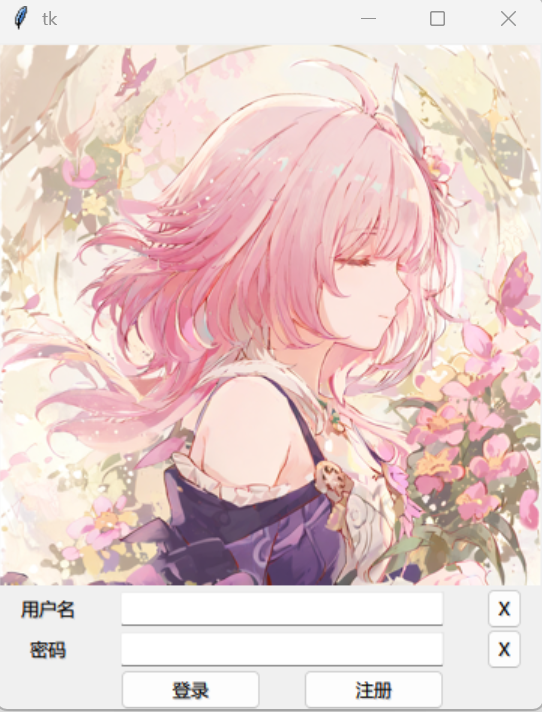

# 输入 Entry
Entry 是一个用于输入单行文本或任何单行信息的控件。

## 演示示例

```python {20,24}
from tkinter import *
from tkinter.ttk import *

import PIL.Image, PIL.ImageTk


def main():
    root = Tk()

    frame = Frame(root)
    frame.grid(row=4, column=4)

    # 图片
    pil_xilian = PIL.Image.open("./resources/135749246_p0.png").resize((360, 360))
    xilian = PIL.ImageTk.PhotoImage(pil_xilian)

    Label(frame, image=xilian).grid(row=0, column=0, columnspan=4)

    Label(frame, text="用户名").grid(row=1, column=0)
    Entry(frame, width=30).grid(row=1, column=1, columnspan=2)
    Button(frame, text="X", width=2).grid(row=1, column=3)

    Label(frame, text="密码").grid(row=2, column=0)
    Entry(frame, show="*", width=30).grid(row=2, column=1, columnspan=2)
    Button(frame, text="X", width=2).grid(row=2, column=3)

    Button(frame, text="登录", width=12).grid(row=3, column=1)
    Button(frame, text="注册", width=12).grid(row=3, column=2)

    root.mainloop()


if __name__ == '__main__':
    main()
```

为了调节显示效果，这里使用 `width` 参数指定了 Button 和 Entry 控件的宽度。无法通过传参来指定控件高度。

显示效果如下：



## 获取 Entry 内容
要获取 Entry 的内容，需要使用 Entry 对象的 get 方法。为此，你需要稍微改写上面的代码。

如下的代码实现了登录按钮的登录功能，在登录时打印给出的用户名和密码。

```python
from tkinter import *
from tkinter.ttk import *

import PIL.Image, PIL.ImageTk


def login(username: str, password: str):  # [!code ++]
    print(f"login with ({username=}, {password=})")  # [!code ++]


def main():
    root = Tk()

    frame = Frame(root)
    frame.grid(row=4, column=4)

    # 图片
    pil_xilian = PIL.Image.open("./resources/135749246_p0.png").resize((360, 360))
    xilian = PIL.ImageTk.PhotoImage(pil_xilian)

    Label(frame, image=xilian).grid(row=0, column=0, columnspan=4)

    Label(frame, text="用户名").grid(row=1, column=0)
    Entry(frame, width=30).grid(row=1, column=1, columnspan=2)  # [!code --]
    entry_username = Entry(frame, width=30)  # [!code ++]
    entry_username.grid(row=1, column=1, columnspan=2)  # [!code ++]
    Button(frame, text="X", width=2).grid(row=1, column=3)

    Label(frame, text="密码").grid(row=2, column=0)
    Entry(frame, show="*", width=30).grid(row=2, column=1, columnspan=2)  # [!code --]
    entry_password = Entry(frame, show="*", width=30)  # [!code ++]
    entry_password.grid(row=2, column=1, columnspan=2)  # [!code ++]
    Button(frame, text="X", width=2).grid(row=2, column=3)

    Button(frame,
           text="登录",
           width=12,
           command=lambda: login(entry_username.get(), entry_password.get())  # [!code ++]
           ).grid(row=3, column=1)
    Button(frame, text="注册", width=12).grid(row=3, column=2)

    root.mainloop()


if __name__ == '__main__':
    main()
```

这样，在点击登录按钮时，控制台将打印在 `login()` 方法中指定的文本。

```text
login with (username='114514', password='123456')
```
