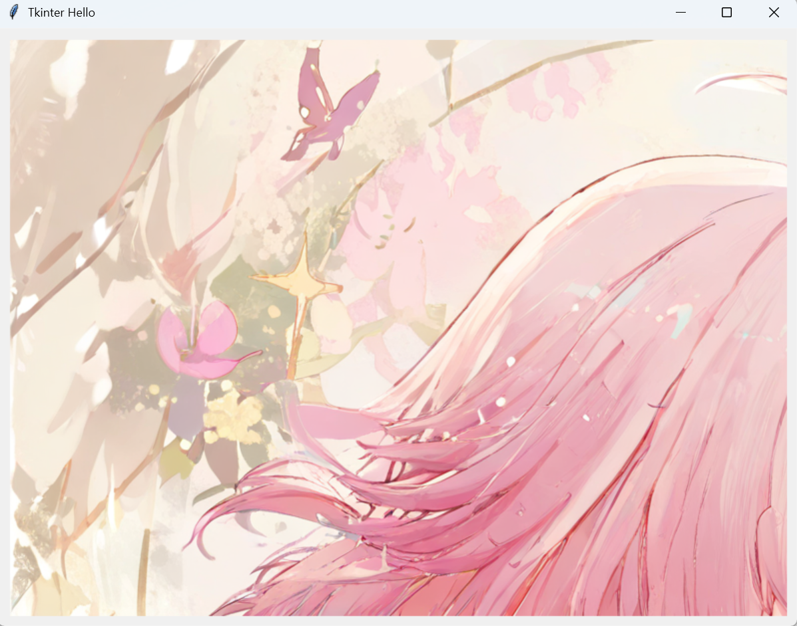
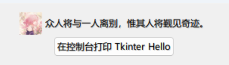

# 标签 Label
标签 Label 用于显示文本、图像、文本和图像。

## 使用

### 显示文本
```python
Label(frame, text="Tkinter Hello ~")
```

`frame` 是 Label 要添加到的地方，可以是 Frame 或窗口。

### 显示图片

#### GIF 和 PNG 格式图像
需要提前使用 Tkinter 的方法将图片处理为 PhotoImage 对象。

必须显示地将 PhotoImage 对象赋值给一个变量，然后在 Label 中使用该变量，否则图像将无法显示。~~你问为什么吗？我也不知道喵！~~

```python
# 可以使用相对路径或绝对路径。如果找不到图片，Python 会抛出异常。
# resources/...
# ./resources/...
# D:AAA/resources/...
# 都是可以滴
photo = PhotoImage(file="./resources/135749246_p0.png")
Label(frame, image=photo).pack()
```

#### JPG 等其他格式图像
可以使用 Python 第三方库 Pillow 处理所有该库支持的格式的图像，然后再转换为 PhotoImage 对象。Pillow 支持所有你叫的上名字的图像格式和大部分你叫不上名字的图像格式，且支持对图像进行编辑，所以随便用~

首先，你需要安装 Pillow 库。

:::code-group

```bash [pip]
pip install Pillow
```

```bash [uv]
uv add Pillow
```
:::

然后在代码文件的头部导入：

```python
import PIL.Image, PIL.ImageTk  # [!code ++]

from tkinter import *
from tkinter.ttk import *
```

:::warning 为何不使用 `from PIL import Image, ImageTk`
Tkinter 的命名空间中也有名为 Image 的东西，会导致**命名空间冲突**，最终结果是 Tkinter 的 Image 和 Pillow 的 Image 只能留下一个。

因此，解决方案是，要么使用 `PIL.Image` ，要么使用 `tkinter.Image`，一般来说选择前者。
:::

然后使用 Pillow 的 Image 的方法打开图像，再使用 ImageTk 将其转换为 Tkinter 的 PhotoImage，即可使用。这里仍然用一张 PNG 作为演示。

```python
# 可以使用相对路径或绝对路径。如果找不到，Pillow 会抛出异常。
photo = PIL.ImageTk.PhotoImage(PIL.Image.open("./resources/135749246_p0.png"))
Label(frame, image=photo).pack()
```

对于以上直接使用 PhotoImage 和使用 Pillow，最终的呈现效果是一致的。



#### 调整图片大小
嗯……图片没显示全，怎么办？

Tkinter 的 Label 会根据内部内容的尺寸调整自己的大小，因此我们只能调整图片的大小，而不能调整 Label 的大小。

为了调整图片大小，我们需要使用 Pillow 库。

```python
pil_image = PIL.Image.open("./resources/135749246_p0.png").resize((300, 300))
photo = PIL.ImageTk.PhotoImage(pil_image)
Label(frame, image=photo).pack()
```

`PIL.Image.resize()` 方法可以缩放调整 PIL.Image 的大小，此方法会返回一个新的 PIL.Image 对象，而非在原来的 PIL.Image 对象上进行修改。

这样，我们就可以让图像在有限大小的窗口中完整显示了。


#### 同时显示图片和文本
Label 也可以同时显示图片和文本。这需要同时传入 `image`、`text` 和 `compound` 属性，其中 `compound` 用于指定文本和图片的编排方式。

我们将图片的尺寸调整为 `(30, 30)`，然后使用 `left`，查看效果：

```python
Label(frame, image=photo, text="众人将与一人离别，惟其人将觐见奇迹。", compound="left").pack()
```



* `left` - 图片在左，文本在右；
* `top` - 图片在上，文本在下；
* 同理还有 `right` 和 `bottom`；
* `center` - 堆叠显示，文本在图片中央，叠在图片上显示。
* 不提供则只显示图片，不显示文本。

## 签名
```python
class Label(Widget):
    """Ttk Label widget displays a textual label and/or image."""

    def __init__(self, master=None, **kw):
        """Construct a Ttk Label with parent master.

        STANDARD OPTIONS

            class, compound, cursor, image, style, takefocus, text,
            textvariable, underline, width

        WIDGET-SPECIFIC OPTIONS

            anchor, background, font, foreground, justify, padding,
            relief, text, wraplength
        """
        Widget.__init__(self, master, "ttk::label", kw)
```
