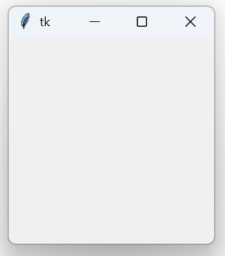

# Tkinter 简介
Tkinter 是 Python 标准库中的 GUI 库，提供在 Python 中最为简单的跨平台 GUI 解决方案。

Tkinter 相比于 PyQt/PySide 等其他方案来说略显底层，并且也难以称得上优雅，但是是一种简单的解决方案，并且有助于我们理解 GUI 编程的思维逻辑。

## 第一个窗口
如下 Python 代码即可创建一个空白窗口，这就是我们的第一个 Tkinter 窗口了。

```python [main.py]
from tkinter import *

def main():
    root = Tk()
    root.mainloop()

if __name__ == '__main__':
    main()
```

运行此文件，你的电脑将打开一个小小的空白窗口，窗口名为 `tk`，窗口图标是一根羽毛。



窗口打开时，IDE 的控制台将保持挂起状态；窗口关闭后，控制台中将显示程序的退出信息。

## Tkinter 的优缺点
Tkinter 是 Python 标准库的一部分，这意味着无需安装任何其他复杂的依赖就可以随地运行 Tkinter GUI，支持 Windows、Linux 和 macOS；同时它的学习难度也很低，可以方便地用于开发体量比较小的工具。作为工具分发时，无论是直接分发 Python 脚本还是打包成可执行文件，占用也较低。

说完优点了，接下来是缺点，也是你不应该永远停留在 Tkinter 的原因：
* **缺少高级控件**：Tkinter 缺少拖拽组件、复杂布局等控件，这意味着使用 Tkinter 实现的 GUI 本身的操作性有限；
* **外观实在不能算好看**：Tkinter 的窗口和控件实在是不能算好看，有一种饱经风霜的时代沧桑感，就是说，丑；
* **性能瓶颈**：Tkinter 的每个控件都是直接调用系统接口，控件数量增加会导致 GUI 占用增加（其他 GUI 方案如 Qt 通过内部的虚拟化控件规避了此问题，显然 Tkinter 没有），在显示大量数据时会造成明显性能问题；
* 由以上问题综合导致的**社区规模小**，可供参考的资料和资源不足。

## 外部资源
Python 的 Tkinter 文档位于：<https://docs.python.org/zh-cn/3.13/library/tkinter.html>
