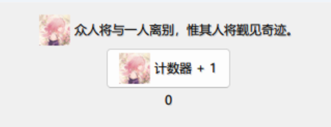
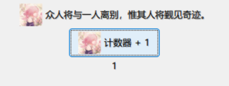

# 变量绑定
<Constructing></Constructing>

TK / Tcl 的底层机制提供了数据与视图绑定的操作方法，类似于现代前端的思想，然而这在 Python 中使用已有的数据类型无法实现，也像现代前端的 Javascript 一样。

因此，Tkinter 使用封装过的特殊变量类型来实现数据与视图的绑定，让数据更新时能够带动视图自动更新，无需手动修改视图。

## 实例
用例子直接理解叭。

```python {19-28}
import PIL.Image, PIL.ImageTk

from tkinter import *
from tkinter.ttk import *


def main():
    root = Tk()
    root.title("Tkinter Hello")
    root.geometry("800x600")

    frame = Frame(root, padding=10)
    frame.pack()

    pil_image = PIL.Image.open("./resources/135749246_p0.png").resize((30, 30))
    photo = PIL.ImageTk.PhotoImage(pil_image)
    Label(frame, image=photo, text="众人将与一人离别，惟其人将觐见奇迹。", compound="left").pack()

    count = IntVar(value=0)

    Button(frame,
           text="计数器 + 1",
           image=photo,
           compound="left",
           command=lambda: count.set(count.get() + 1)
           ).pack()

    Label(frame, textvariable=count).pack()

    root.mainloop()

if __name__ == '__main__':
    main()
```

上面的代码的运行效果如下：



点击按钮会让下面的 Label 中的数字 +1。


